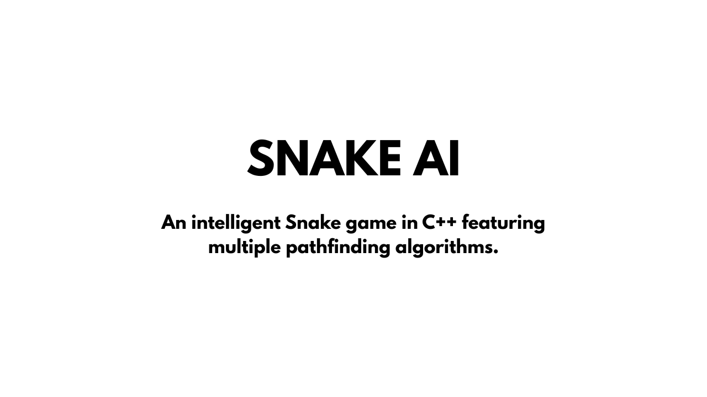
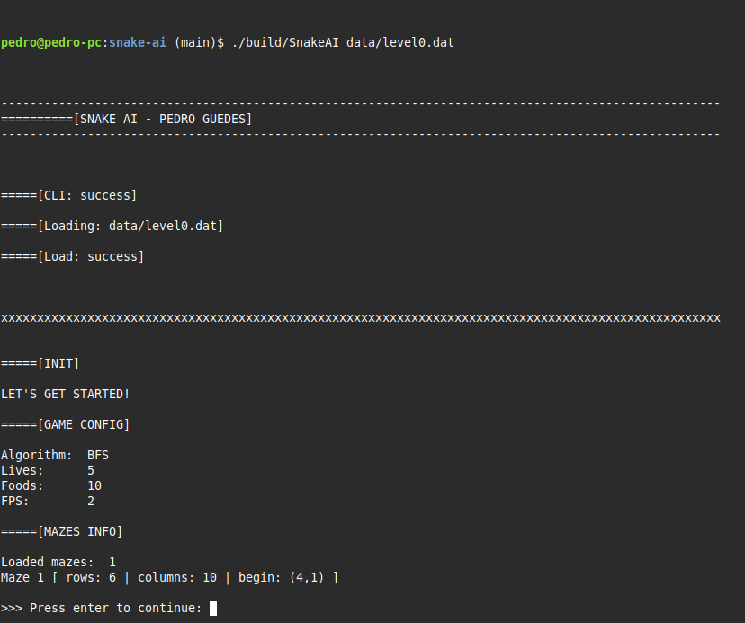
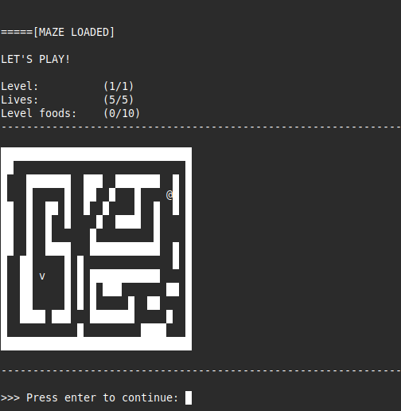
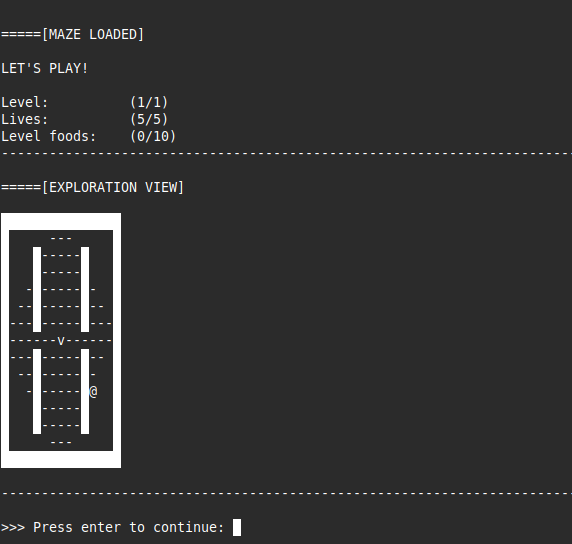
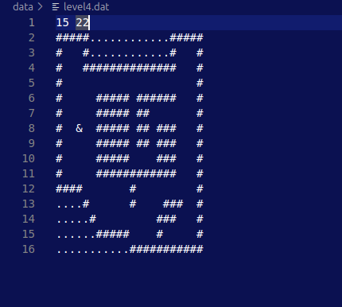

# 🐍 SNAKE AI

Snake AI is a **C++** program where a snake autonomously searches for food inside a maze loaded from a `.txt` file. The project explores multiple pathfinding strategies, including **BFS**, **DFS**, **A\***, **Greedy Best-First Search (GBFS)**, and **Random movement**, enabling performance and behavior comparisons between algorithms.

---

## ▶️ Watch the Demo
[](https://www.youtube.com/watch?v=XKBmLqIaX-A)

---

## 🤖 How It Looks





---

## ⚙️ Build & Run

### Clone the repository  
```bash
git clone https://github.com/pedroguedes-cs/snake-ai.git
cd snake-ai
```
### Build
```bash
# Create build directory
mkdir build

# Compile the project
g++ code/src/algorithmUtils.cpp code/src/ArgumentParser.cpp code/src/PlayerAI.cpp code/src/Snake.cpp code/src/SnakeGame.cpp code/src/utils.cpp code/src/Maze.cpp code/src/main.cpp -o build/SnakeAI
```
### Run
```bash
./build/SnakeAI
```

---

## ⚖️ License
This project is licensed under the [MIT License](LICENSE).

